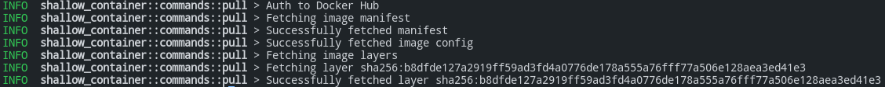
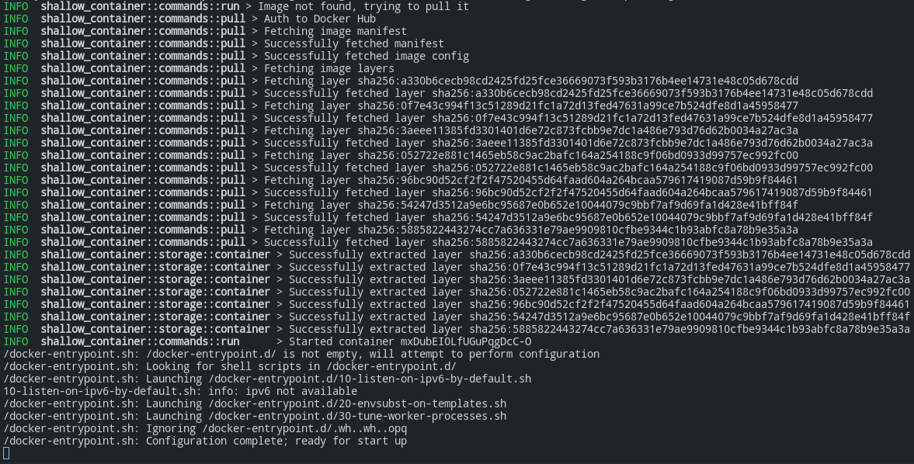

 


Shallow Container is a light-weight container tool written in Rust. It is totally for proof-of-concept and may not suit for production environment.

Shallow Container 是一款Rust编写的轻量级容器工具，用于探索在Rust中实现管理Linux命名空间等功能的可能性。请注意，本程序仅作为学习用途，其设计可能不适合生产用途，请勿在生产环境下使用。

在开发本项目时并没有考虑到诸多方面，致使本项目更像是一个玩具，如果需要细致了解Docker的原理，推荐研究Linux Namespace、cgroups、aufs等知识。

## 概念

Rust是一门非常棒的编程语言，在这入门后不到一年的时间，我逐渐感受到了Rust的魅力，并尝试以Rust为切入点去理解后端框架、操作系统等应用。Shallow Container（简称SC）是100% Rust编写的轻型容器工具，目前支持下面的功能：

- 从Docker Hub下载镜像
- 启动镜像（可选和主机共享Net命名空间）

SC在设计上一定程度参考了[mocker](https://github.com/tonybaloney/mocker)，我和mocker的作者一样花了两天时间写了这样一个程序。程序功能完全比不上Docker的n分之一，在实际执行的过程中也可能有不少问题，不过这已经达到了探索基础知识的目的，后续更深入的容器原理就交给大家和我独自去研究了。

SC的所有文件均保存在`/var/lib/shallow`中，如果需要释放空间，直接删除即可。

## pull

假设程序编译位置为`./target/debug/shallow-container`，如果想pull一个镜像，请执行下面的命令：

```bash
$ sudo ./target/debug/shallow-container pull library/hello-world:latest
```

Image需要是完整的scope/image:tag格式，如果为官方镜像，scope请设置为`library`。你大概会看到这样的输出：



## run

类似的，如果想启动一个容器，请执行下面的命令，如果没找到镜像会先尝试pull：

```bash
$ sudo ./target/debug/shallow-container run library/hello-world:latest
```

默认情况下，SC会为容器使用独立的PID、Net等命名空间。由于SC设计上未考虑到网络相关的功能，所以如果你想运行Nginx容器，可以加上`--Sn`来和主机共享网络命名空间。

```bash
$ sudo ./target/debug/shallow-container run --Sn nginxinc/nginx-unprivileged:latest
```

可以预期的输出如下：



同时你可以访问`http://127.0.0.1:8080`，你应该能够看到Nginx经典的默认网页。

## License

Shallow Container is available under terms of Apache-2.0.
